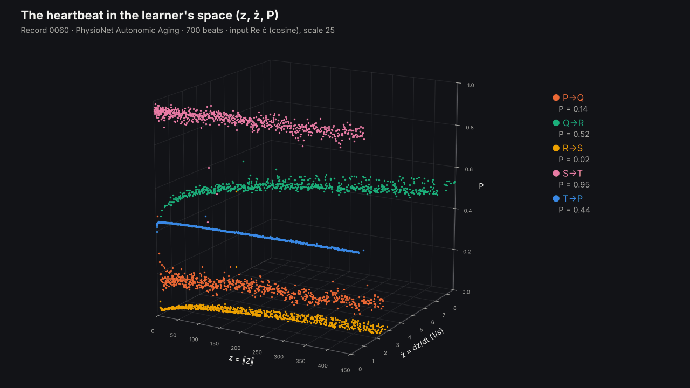
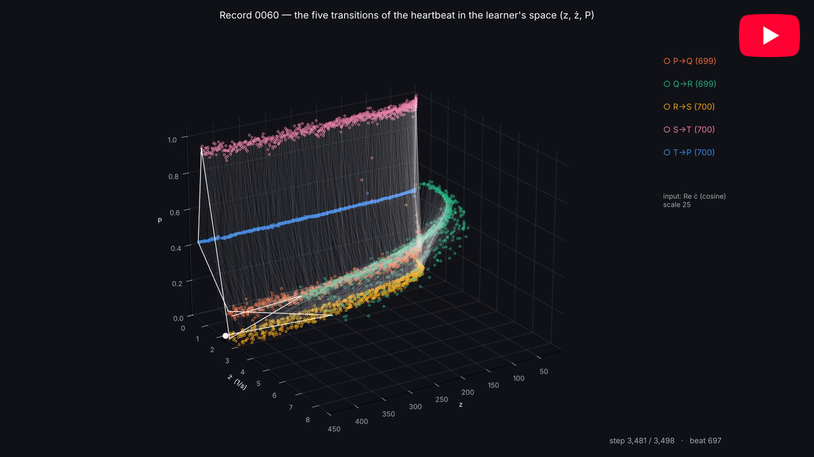

# SKA Heart Rate Variability

 [](https://arxiv.org/abs/2503.13942)   [](https://arxiv.org/abs/2504.03214)   [](https://huggingface.co/quant-iota) [](https://github.com/sponsors/quantiota)


**Heart Rate Variability (HRV) Exploration with Structured Knowledge Accumulation (SKA) and Entropy-Based Learning**

This project applies the SKA entropy learning framework to the raw ECG waveform, streamed in real time, and to the heart rate variability (HRV) it carries — aiming to register informational regimes and subtle physiological patterns not accessible with classical statistics or supervised machine learning.




*The five transitions of the heartbeat in the SKA learner's space (z, ż, P), record 0060 (PhysioNet Autonomic Aging, 700 beats, input Re ċ, scale 25). Each transition keeps a constant probability across the phase space: while knowledge z grows eighteenfold and its flow ż changes, P stays fixed (drift ≤ 0.007). The five flat sheets — S→T 0.95, Q→R 0.52, T→P 0.44, P→Q 0.14, R→S 0.02 — are the invariant signature of a healthy beat, registered by the learner.* [Download](ecg_transition_probability_vr.html) and open on your desktop.


[](https://youtu.be/gYEbg5lCm6o)

*The heartbeat in the learner's space: 700 beats of one healthy heart, read wave by wave by the SKA real-time learner, settle into five bands, one for each transition P→Q→R→S→T. A normal heart has five transitions; an abnormal one should add new bands.*


## Status

Early stage. The work runs in two steps:

1. **Public data first.** The [Autonomic Aging](https://physionet.org/content/autonomic-aging-cardiovascular/1.0.0/)
   database on PhysioNet — resting ECG at 1000 Hz from 1,121 healthy subjects aged 18 to 92 —
   will be replayed as a stream into QuestDB and learned. Heart rate variability is known to
   decline with age, which gives the first readout a reference to be checked against.
2. **Then the device.** [`bitalino-stream/`](bitalino-stream/) reads the raw ECG waveform from
   a BITalino board at the same 1000 Hz and writes it, sample by sample, into the same table,
   so moving from step 1 to step 2 changes only the source.

Results, figures and the sequence library will be added as runs are collected.

The SKA real-time engine is proprietary and is not included in this repository.


## Quick Start

```bash
git clone https://github.com/quantiota/SKA-ECG-Heart-Rate-Variability.git
cd SKA-ECG-Heart-Rate-Variability/bitalino-stream
pip install -r requirements.txt

# test without hardware
python ska_stream.py --simulate --seconds 5 --dry-run

# live ECG from the board (USB) into QuestDB
python ska_stream.py --port /dev/ttyUSB0
```

See [`bitalino-stream/README.md`](bitalino-stream/README.md) for setup, safety notes and the table layout.


## Why the raw waveform

Classical HRV reduces the ECG to beat-to-beat (RR) intervals. Here the learner reads the **raw
waveform at 1000 Hz**: the sample index is a constant 1 ms clock, every beat is read in full
(P wave, QRS complex, T wave), and the rhythm appears in the spacing between beats rather than
being extracted beforehand.


## Why SKA for HRV?

- **Unsupervised regime change detection** in HRV
- **Quantifies entropy** even during stable heart rate segments
- **Registers subtle physiological transitions** that classical HRV analysis does not

## Hypothesis

Physiological signals may carry health-related structure that is registered only through their interaction with an entropy learner, as entropy-regime sequences.

Healthy and pathological conditions may then correspond not only to changes in classical HRV
metrics, but also to differences in entropy-regime grammar, transition diversity, and sequence
organization.

## Following Wheeler

> *"No elementary phenomenon is a phenomenon until it is a registered (observed) phenomenon."*
> — John Archibald Wheeler

The probability bands are not properties of the ECG waiting to be found: they are
**registered by the interaction** between the ordered stream of heart waves and the SKA
real-time learner. The evidence is in the results themselves — the bands are not in the
input values, and their order is not the input order; they are not in a histogram, which
discards the order of the waves; they form only after the learning phase, as the learner's
uncertainty falls; and they live in the learner's own space (z, ż, P).

This is why the project speaks of structure being *registered*, not *hidden* or *discovered*:
the information is produced by the interaction, as it is for the market and the genome.

*Reference: J. A. Wheeler, "Information, physics, quantum: the search for links," in
W. H. Zurek (ed.), Complexity, Entropy and the Physics of Information (Addison-Wesley,
1990).*

## Pathology Sequence Library

Unlike classical supervised machine learning approaches, SKA-HRV does not rely primarily on training large black-box models.

Instead, the framework aims to build a **library of physiological entropy-regime sequences** derived directly from real-time ECG dynamics.

The proposed pipeline is:

```
raw ECG waveform (1000 Hz)
        ↓
SKA entropy computation
        ↓
neutral / rising / falling regimes
        ↓
4-bit transition words
        ↓
binary information flow
        ↓
sequence-pattern mapping
```

A regime is the direction of change from one sample to the next — rising, falling or
neutral. Two consecutive regimes form one of 3 × 3 = 9 transitions; nine values need four
bits, so each transition is written as a 4-bit word, and the stream of words is the binary
information flow.

Under this framework, healthy and pathological cardiac states may correspond to distinct binary transition grammars and entropy-regime organizations.

Examples of future mapped conditions may include:

- Healthy autonomic regulation
- Stress and fatigue states
- Recovery dynamics
- Arrhythmia-related instability
- Autonomic dysfunction
- Sleep-related physiological transitions

The long-term objective is to create an open and extensible SKA Pathology Sequence Library, where physiological conditions are associated with characteristic entropy-transition structures rather than only statistical HRV metrics.

In this sense, SKA-HRV investigates whether cardiac physiology can be interpreted as a measurable informational language emerging from real-time entropy dynamics.


## Related SKA repositories

The same SKA real-time learner, applied to other streams:

- [SKA-Genomics](https://github.com/quantiota/SKA-Genomics) — the E. coli K-12 MG1655 chromosome streamed in replication order: 16 transition bands, 64 trinucleotide sub-bands and the genome's path in the 3D probability space.
- [SKA-quantitative-finance](https://github.com/quantiota/SKA-quantitative-finance) — tick-by-tick market data: probability bands, the 4-bit binary transition space and the sequence library.


## Collaboration & Citation

### 👥 **Collaboration Call: HRV + Machine Learning Researchers**

We seek collaboration with **established HRV researchers who have published in HRV analysis and machine learning** to explore SKA's entropy-based regime discovery in physiological time series.

#### What We Bring:
- **Novel SKA entropy framework:** Proven in market regime detection and genomic sequences, now applied to HRV
- **Entropy learning on the raw ECG stream**, read in order, one sample at a time
- **Registration of regime cycling and subtle state transitions not seen by classical reading**
- **Open-source acquisition stream**

#### Ideal Collaborator:
- **Published HRV researchers** with clinical/medical datasets
- **Machine learning expertise** in time series or physiological signal processing
- **Interest in information-theoretic approaches** to biosignals
- **Willing to co-author research papers/validation studies**

#### Example Collaboration Areas:
- Clinical validation on cardiac datasets (ICU, ambulatory, sleep, etc.)
- Comparison of SKA vs. traditional HRV metrics (RMSSD, pNN50, SDNN, etc.)
- Applications in real-time monitoring: sports, critical care, neurocardiology
- Methodology papers: Information theory meets physiology


#### Citation

If you use or extend this project, please cite:  

* Bouarfa Mahi.
  Structured Knowledge Accumulation: An Autonomous Framework for Layer-Wise Entropy Reduction in Neural Learning
  [arXiv:2503.13942](https://arxiv.org/abs/2503.13942)
* Bouarfa Mahi.
  Structured Knowledge Accumulation: The Principle of Entropic Least Action in Forward-Only Neural Learning
  [arXiv:2504.03214](https://arxiv.org/abs/2504.03214)


**Contact:** Bouarfa Mahi — _especially interested in collaboration with those having access to large HRV datasets or clinical validation environments._


## License

MIT


*SKA-HRV bridges the gap between modern information theory and physiological data science*