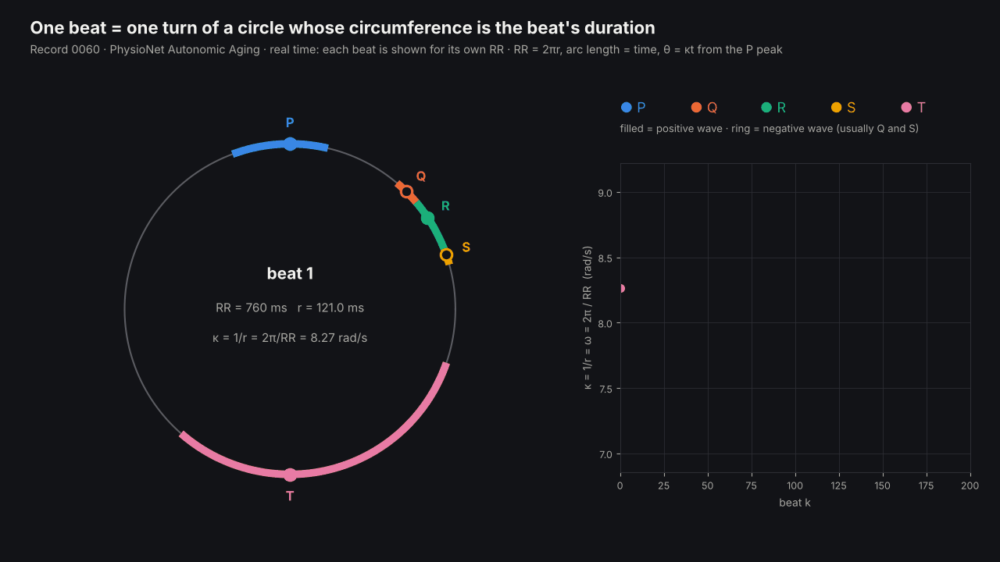
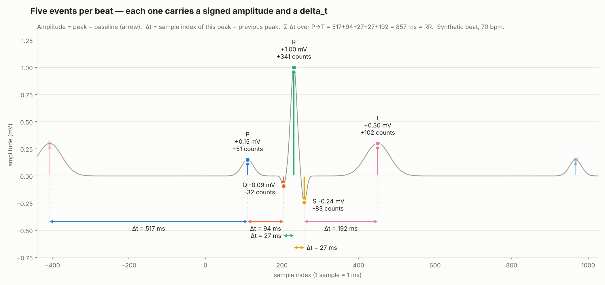
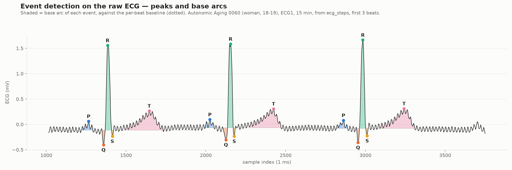
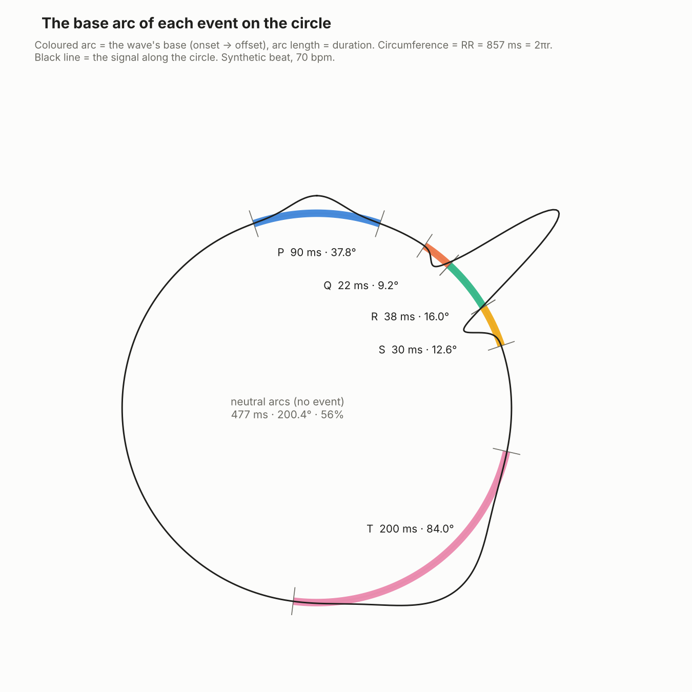
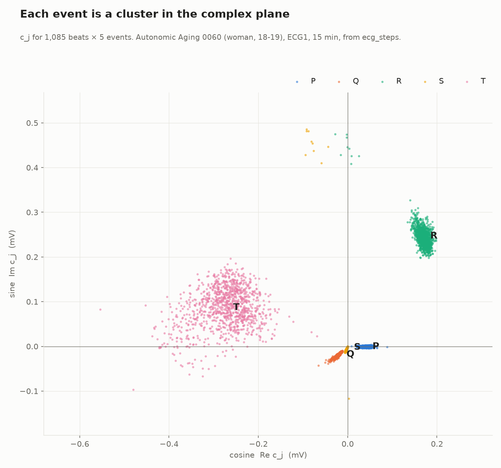
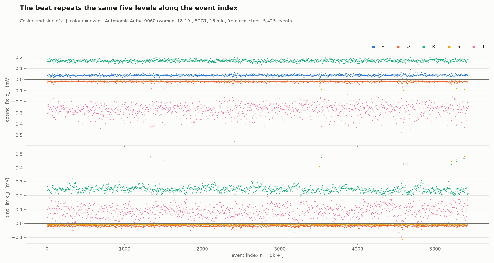
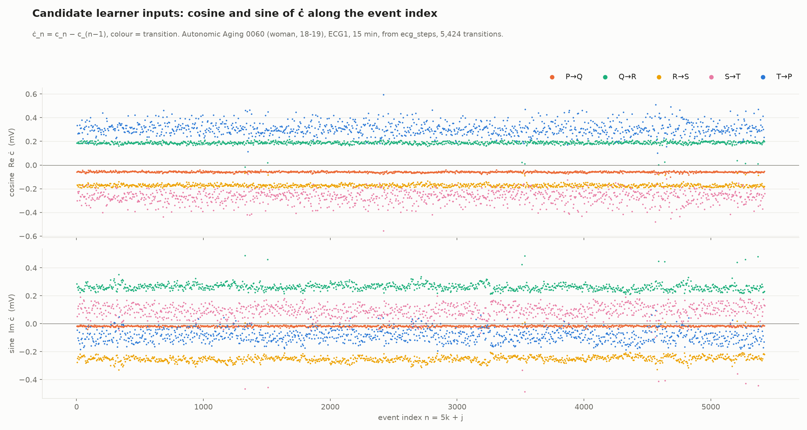
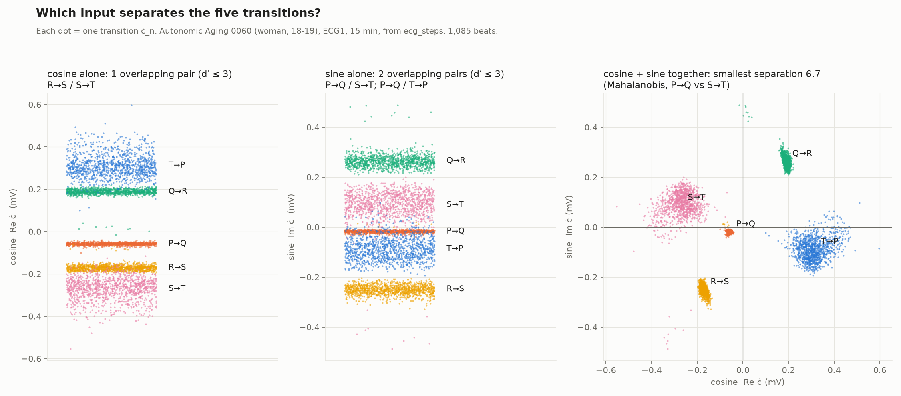
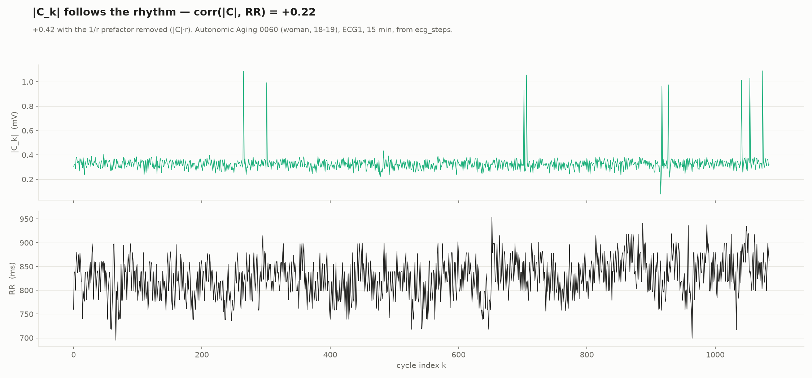

# Complex events — testing the learner input: cosine or sine of ċ

**From the raw ECG waveform to five complex numbers per beat, and two candidate input
streams for the SKA real-time learner: the cosine (Re ċ) and the sine (Im ċ) of the
derivative of those complex numbers along the event index.**

This folder documents the construction, shows it on a synthetic beat and on one real person
— record **0060** of the PhysioNet Autonomic Aging database (woman, 18–19, lead ECG1, 1000 Hz,
15 minutes, 1,085 beats), read from the collected stream `ecg_steps` — and defines the test
that decides which stream the learner reads. The step-by-step version for this person, with
the learner input written out, is in [`aging/README.md`](aging/README.md).



*Record 0060 (PhysioNet Autonomic Aging, woman 18–19), 200 beats in real time — each beat is
shown for its own RR. Every beat is one turn of a circle whose circumference is its duration,
RR = 2πr, so arc length is time: the five waves P, Q, R, S, T sit on their measured base arcs
(onset → offset), at angles θ = t / r from the P peak (filled = positive wave, ring = negative).
The curvature κ = 1/r = ω = 2π / RR (right) changes from beat to beat with the breath: the
waves keep their time, while the circle they are read on tightens and loosens.*


## 1. Five events per beat

The heart fires five events per beat, in a fixed order: **P → Q → R → S → T**. Read on the
sample index (1 sample = 1 ms at 1000 Hz), each event carries:

| element | definition |
|---|---|
| **amplitude** | signed peak relative to the baseline: positive (P, R, T) or negative (Q, S) |
| **delta_t** | ms since the previous event's peak |
| **base arc** | the wave's duration, from onset to offset |

The five delta_t add up to the period of the beat, **RR**. The flat stretches between
waves (about 56 % of a beat) produce no event; they are the neutral hub that every wave
leaves and returns to.



*Figure 1 — Synthetic beat (70 bpm): five events, each with a signed amplitude and a
delta_t. Σ delta_t = 857 ms = RR.*

On a real recording the events and their base arcs are read directly from the raw signal:



*Figure 2 — Record 0060, first three beats. Each event's peak is located around the R peak; its base
arc is the run of samples with the same sign as the peak, against a baseline taken on the
flat stretch before P.*

## 2. One beat is one turn of a circle

The circumference of the circle is the period of the beat:

**RR = 2πr  →  r = RR / 2π**

Arc length is time (1 ms of arc = 1 ms of signal), and an event at time t after the P peak
sits at the angle **θ = t / r**. RR is not stable — it changes beat to beat with breathing
and the autonomic nervous system — so **r changes with every beat**. Each beat has its own
circle.



*Figure 3 — Synthetic beat on its circle. Coloured arcs are the base arcs of the five
events; the rest of the turn is neutral.*

## 3. Each event is a complex number

Integrating the signal over the event's base arc, each sample rotated to its own angle:

**c_j = (1/r) Σ_{t ∈ arc_j} x(t) · e^{i t / r}**

c_j is the event's **phasor**: a complex number carrying an amplitude and an angle. The
letter is c, not z, because in SKA z is the learner's knowledge and ż its flow — the phasor
is what the learner *reads*, z is what it *builds*.

where x is the raw signal minus the baseline, t is in ms from the P peak, and j ∈ {P, Q,
R, S, T}. One complex number carries the three elements of the event:

| | in c_j |
|---|---|
| position | the angle of c_j (centre of the arc) |
| amplitude × arc | the modulus \|c_j\| (≈ area of the wave) |
| sign | a negative wave (Q, S) points the opposite way |

The neutral arcs contribute nothing (x = 0), so the beat's complex number
**C_k = Σ_j c_j** equals the integral over the whole turn: the first Fourier coefficient of
the beat on its circle.

On the real recording each event forms its own tight cluster in the complex plane:



*Figure 4 — c_j for 1,085 beats × 5 events.*

| event | cosine Re c_j (mV) | sine Im c_j (mV) |
|---|---|---|
| P | +0.038 ± 0.007 | −0.001 ± 0.002 |
| Q | −0.020 ± 0.005 | −0.018 ± 0.004 |
| R | +0.168 ± 0.019 | +0.247 ± 0.026 |
| S | −0.003 ± 0.007 | −0.002 ± 0.042 |
| T | −0.274 ± 0.053 | +0.087 ± 0.044 |

R is the tightest cluster; T, the longest wave (arc ≈ 244 ms), is the most spread out. P
lies on the real axis by construction: angles are measured from the P peak.

Along the **event index n = 5k + j** (k = cycle index), the beat repeats the same five
levels:



*Figure 5 — Cosine and sine of c_j along the event index.*

## 4. The candidate inputs: cosine and sine of ċ

The derivative is taken on the event index, not on time:

**ċ_n = c_n − c_{n−1}**

Each value of ċ is one **transition** between successive events. In a normal heart only
five transitions exist — P→Q, Q→R, R→S, S→T, T→P — out of the 25 possible. The two
candidate learner inputs are

- **cosine stream:** Re ċ_n
- **sine stream:** Im ċ_n

one value per event, 5 per beat.



*Figure 6 — Cosine and sine of ċ along the event index, coloured by transition.*

| transition | cosine Re ċ (mV) | sine Im ċ (mV) |
|---|---|---|
| P→Q | −0.058 ± 0.005 | −0.017 ± 0.005 |
| Q→R | +0.188 ± 0.019 | +0.265 ± 0.028 |
| R→S | −0.171 ± 0.014 | −0.249 ± 0.030 |
| S→T | −0.270 ± 0.053 | +0.089 ± 0.064 |
| T→P | +0.312 ± 0.055 | −0.087 ± 0.044 |

## 5. First result: which stream separates the transitions



*Figure 7 — Each dot is one transition. Left: cosine alone. Middle: sine alone. Right:
both together.*

Separation between two transitions is measured as d′ = |mean difference| / pooled std
(d′ > 3 means the levels do not overlap).

| input | distinct levels | overlapping transitions |
|---|---|---|
| **cosine** (Re ċ) | **4 of 5** | R→S and S→T (d′ = 2.56) |
| **sine** (Im ċ) | **3 of 5** | P→Q and S→T (d′ = 2.34); P→Q and T→P (d′ = 2.22) |
| **cosine + sine** | **5 of 5** | none — smallest separation 6.7 (Mahalanobis, P→Q vs S→T) |

- **Cosine** keeps more of the transitions apart. It brings together only R→S and S→T, the
  two steps down after the R peak.
- **Sine** carries the largest swings (Q→R at +0.27 mV, R→S at −0.25 mV, the QRS turning),
  but places P→Q between S→T and T→P, the two transitions that touch the T wave.
- **Together**, the five transitions are five separate clusters.
- The few points away from every cluster (Q→R, R→S, S→T) come from **9 beats out of 1,085
  in which S is absent**: the signal never goes below the baseline after R, so the R arc
  runs on into the T wave. The same 9 beats are the 9 spikes of figure 8.

## 6. The test for the learner

The SKA learner reads one raw stream. The test is run three times on the same recording,
with everything else identical:

| run | learner input (one value per event index) |
|---|---|
| A | cosine: Re ċ_n |
| B | sine: Im ċ_n |
| C | (reference) the raw 1 ms waveform |

For each run, record:

1. **The probability bands** that emerge in the learner's own 3D space (z, ż, P) — its
   knowledge z, the knowledge flow ż and the transition probability P — how many, and
   whether they match the five transitions.
2. **Band stability** — distances between bands after the learning phase.
3. **The path** of the learner through the bands, beat after beat.

The stream that gives **five stable, separated bands** — one per transition — is the input.
The first result above predicts that the **cosine** stream will separate more transitions
than the sine stream, and that a single stream cannot separate all five; if so, the two
streams can be learned as two runs and compared side by side.

The decisive test is then on pathology: on a pathological recording, the chosen stream
should show **new bands** — transitions that never occur in a normal heart (T→Q when P is
missing in atrial fibrillation, T→R for a premature ventricular beat, P→P for a blocked
beat).

## 7. A note on rhythm

The beat-level number \|C_k\| follows the rhythm moderately: on this recording its
correlation with RR is +0.22, and +0.49 once the 9 beats without S are left out (they are the
9 spikes in the top panel). The mechanism expected from the construction — R and S point in
opposite directions, their angular gap Δt / r shrinks when RR is long, so they cancel more —
has little to act on here: in this person S is very small (median |c_S| ≈ 0.006 mV against 0.30 mV
for R).



*Figure 8 — \|C_k\| and RR across the cycle index.*

The rhythm also acts inside the bands of ċ. Within a transition, the value moves with RR
for the transitions around the QRS (correlation with RR):

| transition | cosine Re ċ | sine Im ċ |
|---|---|---|
| P→Q | +0.22 | +0.41 |
| Q→R | +0.24 | −0.91 |
| R→S | −0.37 | +0.90 |
| S→T | +0.16 | +0.80 |
| T→P | +0.08 | −0.28 |

(the 9 beats without S left out)

So RR sets *where inside its band* a transition falls, while the gaps *between* bands
remain much larger (figure 7). The **sine** follows RR closely around the QRS (Q→R, R→S,
S→T); the **cosine** follows it only weakly. When the learner is run, the width of each band should be read with this in mind: on
a recording with large RR swings the bands will widen, without new bands appearing.

## Related work

**The foundation: McSharry, Clifford, Tarassenko & Smith (2003)**, *A dynamical model for
generating synthetic electrocardiogram signals*, IEEE Trans. Biomed. Eng. 50:289–294 — the
model behind ECGSYN on PhysioNet. A point turns around a unit circle, one turn per beat, at
angular speed ω = 2π/RR; RR varies from beat to beat with breathing (~0.25 Hz) and a slower
Mayer-wave rhythm (~0.1 Hz). P, Q, R, S and T are five Gaussian events, each with an angle,
a signed amplitude and a width.

The construction here starts from the same picture. It differs in several ways, and in one
assumption it is the opposite of McSharry's (in bold):

| | McSharry 2003 | here |
|---|---|---|
| purpose | generates a synthetic ECG (a model) | read from the raw signal (a measurement) |
| circle | unit circle | radius r = RR/2π, arc length = time |
| **fixed per event** | **the angle** (P −π/3, Q −π/12, R 0, S π/12, T π/2), the same for every beat — rescaled only once, from the mean heart rate, in the ECGSYN code | **the time** from the P peak |
| when RR lengthens | every event moves later in time, the QRS included | events keep their times; their **angles shrink** |
| one event | three parameters: angle, amplitude, width | one complex number c_j, integrated over its base arc |
| one beat | not summarised | C = Σ c_j, the first Fourier coefficient on the circle |
| derivative | — | ċ on the event index, read as cosine and sine streams |
| use | testing algorithms | input to the SKA learner |

The real heart sits between the two assumptions: the QRS lasts about the same at any heart
rate (fixed time, as here), while the T wave moves partly with RR (QT scales roughly with
√RR, Bazett's relation). The difference has a visible consequence: because the angle between R and S shrinks
when RR is long, the two cancel more, which is the mechanism expected behind a |C|–RR relation
(section 7). With McSharry's fixed angles it would not occur through this mechanism.

In the ECGSYN code (`ecgsyn.m`) the angles and widths are rescaled once from the mean heart
rate: widths by √(hr/60), the angles of Q and S by √(hr/60), of P and T by (hr/60)^¼, R
fixed. The code's default angles for P and T (−70°, +100°) also differ from the paper's
(−60°, +90°).

**Related lines of work**

- **Fitting McSharry's model to real beats** with an extended Kalman filter — Sayadi,
  Shamsollahi & Clifford (2010), who use the fitted wave parameters to detect premature
  ventricular beats. The same paper introduces a **polargram**, a polar representation of
  the ECG beat: the closest prior picture of a beat drawn on a circle, and the first paper to
  compare against.
- **Fourier-series features per beat** for arrhythmia classification (Computing in
  Cardiology 2020).
- **Phase-rectified signal averaging** (Bauer et al. 2006), the method behind deceleration
  capacity. It also aligns beats by phase, but on the RR series rather than on the waveform.
- **Hilbert-transform phase of the ECG**, which gives every sample an angle, continuously,
  without a circle per beat.
- **Vectorcardiography**, which draws the heart's activity as a loop — built from several
  leads placed around the body, not from one lead mapped onto a circle in time.

A first search found no work that folds position, amplitude and arc into one complex number
per event on a circle of radius RR/2π, or that feeds its derivative to a real-time learner.
The search was short, so this is not proof that nothing exists; it is the part to be
checked before any claim of novelty.

Sources: 
- [McSharry et al. 2003 (abstract, PDF)](https://www.lse.ac.uk/CATS/Assets/PDFs/Publications/Papers/2003/53-DynamicModelGenECG-2003-Mchsharry-etal.pdf) ·
- [ECGSYN on PhysioNet](https://physionet.org/content/ecgsyn/) ·
- [ECGSYN model equations](https://www.physionet.org/content/ecgsyn/1.0.0/paper/node4.html) ·
- [ECGSYN MATLAB code](https://physionet.org/files/ecgsyn/1.0.0/Matlab/ecgsyn.m) ·
- [Fourier-series arrhythmia classification, CinC 2020](https://www.cinc.org/2020/Program/accepted/431.html) ·
Sayadi, Shamsollahi & Clifford (2010), *Robust detection of premature ventricular
contractions using a wave-based Bayesian framework*, IEEE Trans. Biomed. Eng. 57(2) —
- [PDF](https://lcp.mit.edu/pdf/sayadiTBME2009.pdf) ·
Bauer, Kantelhardt et al. (2006), *Phase-rectified signal averaging detects
quasi-periodicities in non-stationary data*, Physica A 364:423–434 —
- [record](https://ideas.repec.org/a/eee/phsmap/v364y2006icp423-434.html)

## Reproduce

Requires `ecg-data-validation/` next to this folder, with the records fetched and the
stream collected into `ecg_steps` (see its README).

```bash
pip install -r requirements.txt
cd aging
python make_aging_figures.py 0060      # figures 2, 4–8 and complex_events_0060.csv
```

Figures 1 and 3 (the synthetic beat) are included. `ska_complex_events.py` is the
construction; it can also be run on any one-lead ECG exported as CSV:

```bash
python ska_complex_events.py ecg.csv --column ECG --fs 1000 --out complex_events.csv
```

Both write one row per event:

| column | meaning |
|---|---|
| `event_index` | n = 5k + j |
| `k`, `event` | cycle index and event name (P, Q, R, S, T) |
| `peak`, `onset`, `offset`, `arc` | sample indices of the peak and base arc; arc length in ms |
| `amplitude` | signed peak − baseline (mV) |
| `RR`, `r` | beat period (P peak → next P peak) and radius RR / 2π |
| `c_cos`, `c_sin` | Re c_j, Im c_j |
| `transition` | previous event → this event |
| `cdot_cos`, `cdot_sin` | **the candidate inputs**: Re ċ_n, Im ċ_n |

## Data and limits

- **Real data:** record 0060 of the PhysioNet Autonomic Aging database — one healthy woman
  aged 18–19, lead ECG1, 1000 Hz, the first 15 minutes, 1,085 beats (RR 827 ± 41 ms). It is
  one person: the numbers above are a first look, not a result about hearts in general.
- **Synthetic beat** (figures 1 and 3): five Gaussian waves with normal lead-II values,
  for illustration only.
- **Event detection** finds the R peaks on a cleaned copy of the signal (50 Hz removed,
  QRS band 5–20 Hz; `aging/detect_beats.py`) and measures everything on the raw signal. It
  then uses fixed windows around each R peak (P: −280 to −80 ms, Q: −60 to
  0 ms, S: 0 to +60 ms, T: +120 ms to 60 % of the next RR). It assumes a normal beat order
  and will need to be adapted for pathological beats, where events can be missing or out
  of order.
- **Base arcs** are same-sign runs around each peak. When a wave is absent the rule still
  assigns it: in 9 of the 1,085 beats S never goes below the baseline, so the R arc runs on
  through the T wave (up to the 250 ms window) and S is a point at about zero.
- Next data: the BITalino stream (1000 Hz, `bitalino-stream/`), then a pathological
  recording.
