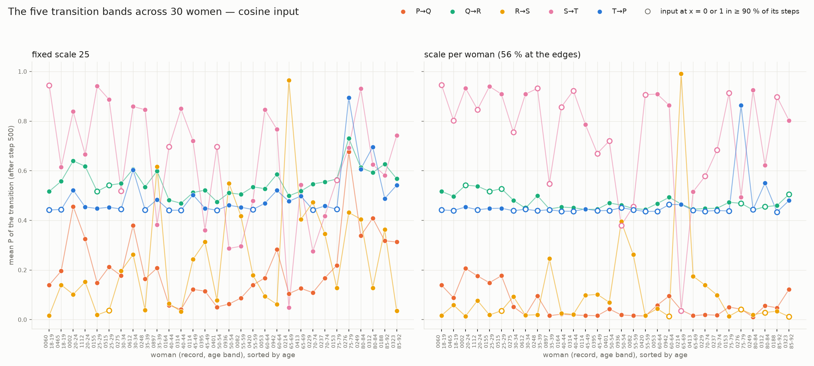

# SKA learning on the ECG event stream — results


[](https://youtu.be/gYEbg5lCm6o)

* Record 0060, PhysioNet Autonomic Aging: a healthy woman aged 18–19, raw ECG at 1000 Hz, 700 beats. Each wave of the heartbeat (P, Q, R, S, T) becomes a phasor on a circle whose circumference is the beat's duration. The learner reads one number per wave, the cosine of the phasor's step from the previous wave. Without labels or rules about cardiology, it organises the five transitions of the heartbeat (P→Q, Q→R, R→S, S→T, T→P) into five separate, stable bands in its own space (z, ż, P), where z is knowledge, ż its flow and P the transition probability.

A normal heart has five transitions. An abnormal one should add new bands.*


**What the SKA learner does with the five waves of the heartbeat: nine runs on one person
(three inputs × three scales), then each of 30 women at a fixed scale and at her own scale.**

This folder holds the **results** of the SKA engine: the learner's output for every step,
and the figures. The engine code is not published. The data it reads is reproducible from
the two phase-1 folders: [`ecg-data-validation/`](../ecg-data-validation/) (the collected
stream `ecg_steps`) and [`complex-events/`](../complex-events/) (the phasors and the input).

The people are the 30 women of the PhysioNet
[Autonomic Aging database](https://physionet.org/content/autonomic-aging-cardiovascular/1.0.0/)
selected in phase 1 ([`ecg-data-validation/records.txt`](../ecg-data-validation/records.txt)):
two per age band from 18 to 92, lead ECG1, 1000 Hz, 15 minutes each. The first, **record
0060** (aged 18–19, 1,085 beats), was studied in detail.

---

## The question

Each beat has five waves, P → Q → R → S → T, so a normal heart has five transitions:
P→Q, Q→R, R→S, S→T, T→P. **Does the learner, reading one number per wave, find these five
states on its own?** If it does, the phasor construction of `complex-events/` carries the
structure of the beat.

## The input

For each wave n, its phasor c_n (see [`complex-events/aging/README.md`](../complex-events/aging/README.md)),
then the return and the input:

$$
\dot c_n = c_n - c_{n-1}, \qquad
x_n = \frac{1}{1 + e^{-s\, u_n}}
$$

| input | u_n |
|---|---|
| `cdot_cos` | Re ċ_n — cosine |
| `cdot_sin` | Im ċ_n — sine |
| `cdot_cossin` | Re ċ_n + Im ċ_n — cosine + sine |

with **s = 5, 25 or 50** (per mV). One step is one wave, five steps per beat. Each run is one
loop of **3,500 steps = 700 beats**, the size limit of the learner's matrix. The time between
steps is the real time between the peaks of successive waves.

## What is measured

Three quantities per step, all in the run CSVs (P and ż computed from the learner's output):

| | definition |
|---|---|
| **H** | the learner's entropy (`entropy`) |
| **P** | the transition probability, P = exp(−\|ΔH / H\|) |
| **z, ż** | the knowledge z = ‖Z‖ (`knowledge`) and its rate ż = dz/dt, per second — central difference `np.gradient(z) / Δt` as in the genomic engine (`zdot`), or backward difference Δz / Δt (`zdot_back`) |

(z, ż, P) is the learner's own 3D space. A state of the heart is **found** when its
transition forms its own band there.

## Record 0060: nine runs

| input | scale | x at 0 or 1 | distinct H curves | P bands overlapping (d′ ≤ 3) | in (ż, P), ż central | in (ż, P), ż backward |
|---|---|---|---|---|---|---|
| cosine | 5 | 0 % | **5** | P→Q/T→P, P→Q/R→S, Q→R/S→T | **none** | **none** |
| cosine | 25 | 56 % | 3 | **none** | **none** | **none** |
| cosine | 50 | 80 % | 3 | P→Q/R→S | P→Q/R→S (1.8) | none |
| sine | 5 | 0 % | 4 | P→Q/T→P, Q→R/T→P, S→T/T→P | S→T/T→P (2.9) | none |
| sine | 25 | 40 % | 4 | 6 pairs | none | none |
| sine | 50 | 59 % | 3 | 4 pairs | none | P→Q/S→T (2.2) |
| cosine + sine | 5 | 0 % | **5** | 6 pairs | S→T/T→P (2.3) | S→T/T→P (1.1) |
| cosine + sine | 25 | 62 % | 3 | Q→R/T→P | none | none |
| cosine + sine | 50 | 79 % | 2 | Q→R/T→P | none | none |

Measured after step 500 (the learning phase). Two H curves count as one when their median
gap is under 3 % of their depth; two transitions overlap in (ż, P) when their Mahalanobis
distance is under 3. The (ż, P) result depends on how ż is taken on three rows; the
cosine at scales 5 and 25 separates all five under both definitions. Leaving out the 9 beats
without S changes none of the rows.

Mean P per transition:

| input | scale | P→Q | Q→R | R→S | S→T | T→P |
|---|---|---|---|---|---|---|
| cosine | 5 | 0.56 | 0.74 | 0.46 | 0.82 | 0.57 |
| cosine | 25 | 0.14 | 0.52 | 0.02 | 0.95 | 0.44 |
| cosine | 50 | 0.03 | 0.46 | 0.01 | 1.00 | 0.44 |
| sine | 5 | 0.89 | 0.74 | 0.30 | 0.64 | 0.72 |
| sine | 25 | 0.67 | 0.61 | 0.02 | 0.46 | 0.20 |
| sine | 50 | 0.62 | 0.56 | 0.02 | 0.45 | 0.09 |
| cosine + sine | 5 | 0.59 | 0.65 | 0.11 | 0.72 | 0.64 |
| cosine + sine | 25 | 0.09 | 0.49 | 0.01 | 0.91 | 0.45 |
| cosine + sine | 50 | 0.01 | 0.44 | 0.01 | 0.99 | 0.44 |

## What it shows

- **The five states emerge.** With the cosine input, the learner separates all five
  transitions: in H at scale 5 (five distinct curves), in P at scale 25 (five bands, no
  pair overlapping), and in the (ż, P) plane at both, whichever way ż is taken.
- **The scale trades H against P.** At low scale the input keeps its full range and H keeps
  the five states apart. At higher scale the input becomes almost binary: H merges the
  transitions that land on the same edge (Q→R with T→P at x ≈ 1, R→S with S→T at x ≈ 0),
  while P — which compares each step with the previous one — sharpens into thin bands.
  At 50 P starts merging again.
- **The cosine carries the most.** The sine merges the transitions around the T wave at
  every scale; the sum of cosine and sine is not better than the cosine alone.
- **The learner registers a change of state by itself.** Around step 3,270 (beat 654, minute
  9) the R→S band shifts in the scale-5 runs: P rises from 0.29 to 0.32 with the sine, and
  from 0.104 to 0.111 with cosine + sine. The same beat is where the rhythm slows (mean RR
  818 ms over beats 550–649, 848 ms over beats 654–700, the end of the run) and where the
  phasors step in `complex-events/` (figures 6 and 8).

## All 30 women

One run per woman, cosine input, 3,500 steps, at two settings:

- **fixed scale 25**, the setting that gave five separate P bands on 0060;
- **a scale per woman**, chosen so that every heart is read at the saturation of 0060's best
  run, 56 % of x at 0 or 1. Since x reaches the edge when |s·u| > ln 99,

$$
s_w = \frac{\ln 99}{q_{0.44}(|u|)}
$$

  with q₀.₄₄ the 44th percentile of the woman's |Re ċ| over the **first 500 steps** (the
  learning phase), so the scale uses no future data, as in real time. It gives 25.1 for
  0060 and 24.9 for 0155; most women need 33–70, the oldest up to 237.



*Mean P of each transition for every woman, sorted by age. Left: fixed scale 25. Right:
scale per woman. An open circle marks a transition whose input is at x = 0 or 1 in at least
90 % of its steps: its level is set mostly by the edge of the sigmoid.*

| | scale 25 | scale per woman |
|---|---|---|
| spread of x at 0 or 1 between women (sd) | 20 points | 3.8 points |
| five separate P bands | 2 of 30 (0060, 0155) | **3 of 30** (0060, 0155, 0002) |
| five separate bands in (ż, P), both ż definitions | 4 of 30 | **6 of 30** |
| median number of overlapping P pairs (of 10) | 4.5 | **2** |
| Q→R band at P = 0.44–0.55 | 17 of 30 | **30 of 30** |
| T→P band at P = 0.43–0.47 | 18 of 30 | **27 of 30** |
| most frequent overlap | P→Q/R→S and Q→R/S→T (21 each) | P→Q/R→S (25) |

The measures for each woman are in
[`results/scale25/summary_scale25_cos.csv`](results/scale25/summary_scale25_cos.csv) and
[`results/scale_per_woman/summary_scale_per_woman_cos.csv`](results/scale_per_woman/summary_scale_per_woman_cos.csv);
the scales in [`results/scale_per_woman/scale_per_woman.csv`](results/scale_per_woman/scale_per_woman.csv).

### What it shows

- **A fixed scale in mV reads each heart differently.** At scale 25 the share of x at 0 or 1
  runs from 0 % to 59 % between women and falls with age (Spearman −0.48, p = 0.007): the
  waves are smaller in older women. The two women with five clean bands both sit at 56 %.
- **The age trends at scale 25 were the saturation.** T→P and R→S rise with age at scale 25
  (p = 0.02 and 0.04); with a scale per woman the trend disappears (Spearman +0.03 for
  both). What remains is a weak fall of P→Q and S→T with age (p ≈ 0.05), borderline with
  30 women.
- **Q→R and T→P sit at the same level in almost every heart, partly by construction.** At
  56 % saturation, T→P's input is at x = 1 in 99 % of its steps and S→T's, just before it,
  at x = 0 in 96 % (medians over the women): T→P is a jump from one edge to the other, and
  its P is nearly fixed. Q→R is less pinned (68 %). P→Q and R→S stay off the edges and are
  the ones that differ between women.
- **Separation improves but is not complete**: the main remaining overlap is P→Q with R→S
  (25 of 30), both near P = 0. R→S and S→T can even swap between women (0214: R→S 0.99,
  S→T 0.04).

## Limits

- **30 healthy women**, 15 minutes each, one lead. Nothing here is a result about hearts in
  general, nor about men.
- **ż is partly timing.** ż divides the change of z by the time since the previous wave, and
  that time differs a lot by transition (≈ 30 ms for Q→R, several hundred for T→P). Part of
  the separation along ż comes from the timing of the beat, not from the input x.
- **z mostly counts steps**: it grows with the size of the matrix. The separation that
  matters is in P and ż.
- **9 beats of 1,085 have no S wave in 0060** (see `complex-events/`); they are the few
  points away from their bands. Other women may have their own; they were not inspected one
  by one.
- **The bands are transition bands.** P compares each step with the previous one, so a band
  is a passage between two successive waves, not a property of one value. The order
  P → Q → R → S → T is therefore part of what is learned: it is the structure of the beat.
  In pathology that order breaks, and new transitions should appear as new bands.
- **The scale.** A fixed scale in mV gives each woman a different input range (see `x_min`,
  `x_max` in `complex-events/aging/summary_all.csv`), and this shapes the bands. The
  per-woman rule removes most of it, but a fixed 56 % puts about three of the five
  transitions at the edges; for a heart where only two transitions are large it could clip
  a small one. An alternative is s = c / median(|u|), with c set to give 25 on 0060.

## Next test

**A scale that saturates less.** The 56 % rule pins T→P and S→T to the edges, so their
common level cannot be read as a property of the heart. The next run uses
s = c / median(|u|), with c set to give 25 on 0060, on the same 30 women. The question: do
Q→R and T→P stay common when they are no longer pinned, and does P→Q separate from R→S?

## Files

```
results/
├── bands_30_women.png   the five bands across the 30 women, both scales
├── 0060/                record 0060: 9 runs (3 inputs × scales 5, 25, 50), 21 figures
├── scale25/             30 women at the fixed scale 25 + summary_scale25_cos.csv
└── scale_per_woman/     30 women at their own scale + scale_per_woman.csv
                         + summary_scale_per_woman_cos.csv
```

Each woman's folder holds `ska_<record>_runs.csv` and two figures: `ska_<record>_<input>_scale<s>.png`
(H and P along the steps) and `bands3d_<record>_<input>_scale<s>.png` (the bands in
(z, ż, P)). In `0060/` there is one pair per input and scale (no suffix = scale 5), plus
`bands3d_0060_compare[_scaleN].png`, the three inputs side by side.

## Data — `ska_<record>_runs.csv`

One row per step, ordered by input, scale and step: 9 runs × 3,500 = 31,500 rows in
`results/0060/`, one run × 3,500 rows per woman in `results/scale25/<record>/` and in
`results/scale_per_woman/<record>/`.
`results/scale25/summary_scale25_cos.csv` holds one row per woman with the measures of the
30-woman table at scale 25, and `results/scale_per_woman/summary_scale_per_woman_cos.csv`
the same for the per-woman scale (with a `scale` column).

| column | meaning |
|---|---|
| `record_id`, `input`, `scale` | the run |
| `event`, `transition` | the wave (P, Q, R, S, T) and the transition into it |
| `event_index`, `k`, `peak` | step n = 5k + j, beat k, sample index of the wave's peak |
| `value_cos`, `value_sin` | Re c_n, Im c_n (mV) |
| `value_return` | u_n: Re ċ_n, Im ċ_n or their sum (mV) |
| `x_input` | x_n, what the learner reads |
| `rr` | the beat's duration (ms) |
| `knowledge` | z = ‖Z‖ |
| `decision`, `decision_norm` | the learner's last decision D and ‖D‖ |
| `entropy` | H |
| `delta_t` | time since the previous wave (s) |
| `cosine_similarity`, `delta_h_over_delta_d`, `frobenius_norm`, `matrix_size` | learner diagnostics |
| `P`, `zdot`, `zdot_back` | **computed at export**, not stored by the engine: P = exp(−\|ΔH/H\|) from `entropy`; ż from `knowledge` and `delta_t`, central (`zdot`) and backward (`zdot_back`) difference |
| `timestamp` | the wave's time in the recording |
